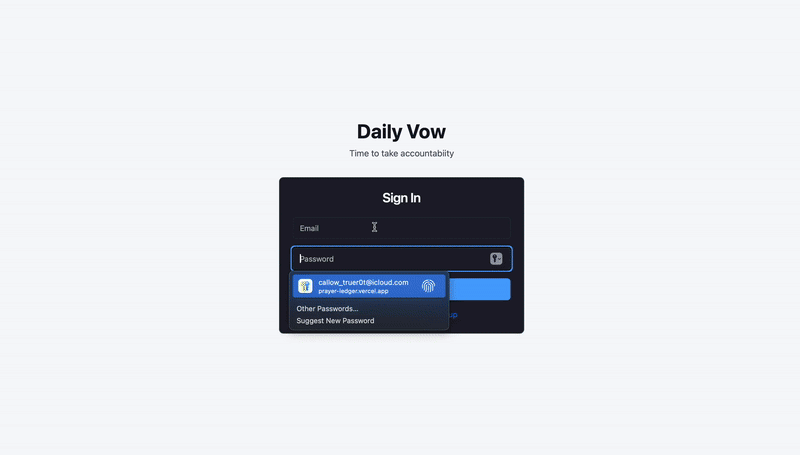

# Daily Vow 🙏

Daily Vow is a focused and peaceful web application for organizing your commitment to life and building consistent habits with the help of an **AI-powered assistant** and **daily progress tracking**. It replaces the chaos of scattered notes with a single, dedicated space for your personal and spiritual journey.

## The Problem It Solves

We all start new, positive habits with great intentions, but keeping them is hard. The problem isn't a lack of desire; it's **friction**. Tracking important personal goals on scattered notes, phone reminders, or just in our heads is disorganized and works against us. This friction is what causes good habits to fail.

Daily Vow was designed from the ground up to eliminate that friction by providing a simple, beautiful, and dedicated system to focus on what matters.

## ✨ Key Features

  * **🤖 AI Vow Assistant**: Leverages Google's Gemini API to turn vague user goals into specific, measurable, and actionable vows through a guided, conversational interface.
  * **📈 Progress Tracking & Streaks**: A simple "Check-In" system for each active vow to log daily progress, with an automated streak counter to build motivation and consistency.
  * **📊 Home Dashboard**: An inspiring overview of your journey with key stats like active vows, answered commitments, weekly check-ins, and your current streak.
  * **✍️ Full Vow Management (CRUD)**:
      * **Create**: Easily add new vows with titles, details, and categories.
      * **Read**: View all active and answered vows in clean, organized lists.
      * **Update**: Mark vows as "answered" to celebrate and track your journey.
      * **Delete**: Remove vows that are no longer needed.
  * **✅ Secure User Authentication**: Private and secure user accounts with email & password login.
  * **👤 Profile Management**: A dedicated page to securely change your password and manage your account.
  * **📱 Fully Responsive**: A seamless experience on desktop, tablet, and mobile devices.

## 🛠️ Tech Stack

| Category             | Technology                                                  |
| -------------------- | ----------------------------------------------------------- |
| **Frontend** | Next.js, React, TypeScript                                  |
| **Backend** | Supabase (PostgreSQL Database, Authentication, RLS)         |
| **AI / Generative** | Google Gemini API                                           |
| **Styling** | Tailwind CSS                                                |
| **Deployment** | Vercel                                                      |

## 🏗️ Core Architectural Principles

This project was built with a strong focus on professional development practices to ensure it is not only functional but also scalable, maintainable, and accessible.

  * **🎯 Strategic & Focused MVP**: The project began with a deep analysis of the core user problem, leading to a focused Minimum Viable Product (MVP) scope. Every feature was intentionally chosen to solve the primary problem of "user friction" without adding unnecessary complexity.

  * **🧱 Clean & Maintainable Architecture**: The codebase follows a strict **separation of concerns**.

      * UI Components (`/components`) are distinct from Routing & Pages (`/app`).
      * Business Logic & Database interactions (`/lib`) are centralized, ensuring that the code is easy to read, debug, and scale in the future.

  * **♿ Accessibility as a Core Feature**: Accessibility was not an afterthought. The application was built to be inclusive, following best practices such as:

      * Semantic HTML.
      * Proper use of `<label>` tags for all form inputs.
      * Full keyboard navigability with clear focus indicators.

## 🚀 Live Demo



## ⚙️ Getting Started (Local Setup)

To get a local copy up and running, follow these simple steps.

#### Prerequisites

  * Node.js (v18 or later)
  * npm

#### Installation

1.  **Clone the repository:**
    ```bash
    git clone https://github.com/JoshuaViera/prayer-ledger.git
    ```
2.  **Navigate to the project directory:**
    ```bash
    cd prayer-ledger
    ```
3.  **Install NPM packages:**
    ```bash
    npm install
    ```
4.  **Set up your environment variables:**
      * Create a file named `.env.local` in the root of the project.
      * Add your Supabase and Gemini API keys to this file.
    <!-- end list -->
    ```env
    # Get these from your Supabase project's API settings
    NEXT_PUBLIC_SUPABASE_URL=your_project_url_here
    NEXT_PUBLIC_SUPABASE_ANON_KEY=your_anon_key_here

    # Get this from Google AI Studio
    NEXT_PUBLIC_GEMINI_API_KEY=your_gemini_api_key_here
    ```
5.  **Run the development server:**
    ```bash
    npm run dev
    ```

Open `http://localhost:3000` with your browser to see the result.

## 👤 Contact

Joshua Viera - joshuaviera95@gmail.com

Project Link: [https://github.com/JoshuaViera/prayer-ledger](https://github.com/JoshuaViera/prayer-ledger)
